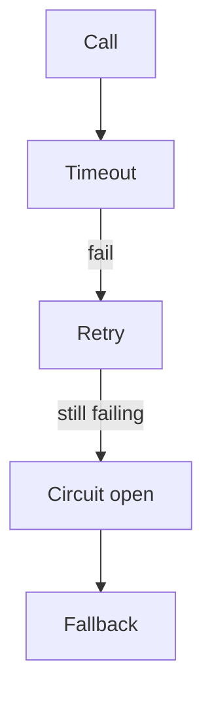

# Resilience

Spring · 20 min

Timeout, a small retry, then stop. A circuit breaker is for a dependency that is failing fast.

## Flow



## Resilience

Retry only idempotent calls. A retry of a charge without a key is a double charge. Backoff with jitter. A circuit opens after a threshold and fails fast so you do not pile threads on a dead host. The fallback must be something you can explain: a cached metadata read, or an error to the user. Resilience4j is the library. The policy is the interview. The agent's tool call has a timeout. It does not retry a mutation until the approval and the key exist.

## Play this

1. Name it
2. Say the rule
3. Tie it to the project or a problem
4. One sentence from memory tomorrow

## Steps

- Read the rule once.
- Write the example from a blank file.
- Say the interview answer out loud.

## Example

```text
timeout 2s
retry 2 times, idempotent GET only
then 503 with the request id
```

## The usual miss

Retrying POST three times with no key.

## They will ask

Which calls in the project are safe to retry?

## Before you close the laptop

Write timeout and retry count for the metrics read.
