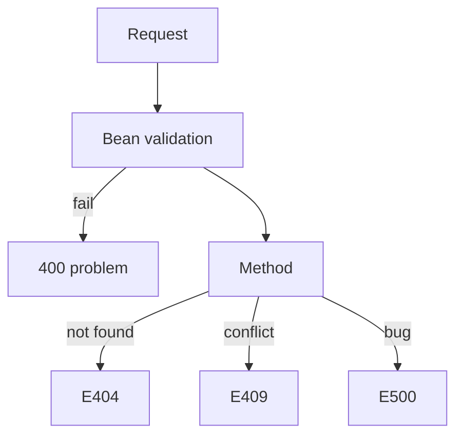

# REST, validation, and one error shape

Spring · 35 min

A senior backend answer includes the status code, the body, and what the client can retry. Annotations are the implementation.

## Flow



## The contract

Resources are nouns. GET is safe. PUT replaces. POST creates or starts a command. A command that must not run twice takes an Idempotency-Key header. Validation errors are 400 with the field name. Authentication is 401. Authorization is 403. You already know the words. The interview is whether the API you design uses them consistently.

## Exceptions

The service throws a domain exception. The advice translates it. A catch that logs and returns null hides the failure from the client and from the metric. Checked exceptions in a Spring service are usually noise. A transaction rolls back on a runtime exception. Say that when they ask what happens if the handler throws.

## Play this

1. Validate at the boundary
2. One error JSON
3. 409 for an idempotency conflict
4. Do not leak stack traces

## Steps

- Controller methods take a DTO. Bean validation annotations reject a blank bucket id before the service runs.
- A @ControllerAdvice maps exceptions to a problem body: code, message, request id. The client never sees a stack.
- POST that creates is 201 with a location, or 200 on an idempotent replay. A bad id is 404. A version clash is 409.
- Pagination is limit and cursor, not an unbounded list.

## Example

```text
{
  "code": "bucket_not_found",
  "message": "No bucket b1",
  "requestId": "9f2c"
}
```

## The usual miss

Returning 200 with {success:false} for every failure.

## They will ask

The same idempotency key arrives with a different body. What status?

## Before you close the laptop

Add one @ControllerAdvice to the project and one test that expects 400.
