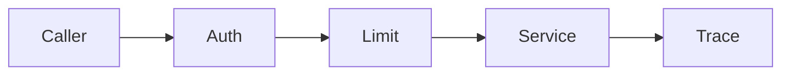

# Security, resilience, actuator

Spring · 30 min

JWT and OAuth answer who is calling. Resilience answers what you do when the next service is sick. Actuator and traces answer what happened.

## Flow



## Play this

1. Authenticate then authorize
2. Timeout every remote call
3. Retry only idempotent calls
4. A trace id crosses the agent

## Steps

- Spring Security: filter authenticates, method or route rules authorize.
- Resilience4j or a simple policy: timeout, small retry with jitter, circuit breaker when the dependency is down.
- Micrometer plus actuator. A correlation id from the HTTP request lands in the Kafka header and the agent log.

## Example

```text
Do not retry a payment POST unless the idempotency key makes the retry safe.
```

## The usual miss

Logging the full prompt and the customer's object listing.

## They will ask

Which calls are safe to retry?

## Before you close the laptop

Add one correlation id to the story you will tell about DefectIQ-style RAG. No internal data.
