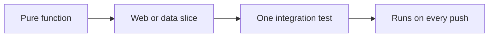

# Tests that protect the interview story

Spring · 30 min

The tests worth writing are the ones you will mention: idempotency, the outbox commit, and the N+1 you already fixed.

## Flow



## The pyramid for this project

Most tests are plain JUnit on pure code: refill math, partition-key choice, prompt assembly. A few tests use the database because the bug lives in the transaction. One test calls the agent with a fake model so the eval set runs without a bill. CI runs them. A test you cannot run on the laptop is a demo, not a test.

## What interviewers listen for

They ask how you knew the fix worked. The answer is a failing test that reproduced the duplicate, then the constraint or the idempotency lookup that made it pass. That story beats a coverage percentage.

## Play this

1. Test the behavior you claim
2. One database test for the outbox
3. Mock the agent, not the transaction
4. A red test before the fix

## Steps

- A unit test covers the token bucket math with a fake clock.
- A data test starts Postgres, writes the business row and the outbox row, and asserts both exist or neither does.
- A web test sends the same Idempotency-Key twice and asserts one row.
- Do not mock the repository and then claim you tested the transaction.

## Example

```text
@Test
void replayDoesNotCreateASecondBucket() {
    api.create(key, body);
    api.create(key, body);
    assertEquals(1, buckets.count());
}
```

## The usual miss

A hundred controller tests that only check 200.

## They will ask

Which test would fail if the outbox write left the transaction?

## Before you close the laptop

Add that one test name to the README, even before it passes.
