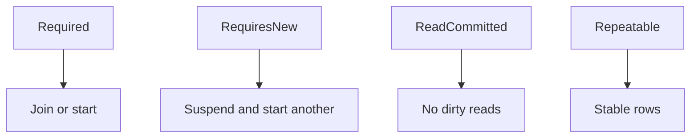

# Transactions, propagation, isolation

Spring · 40 min

This is SDE II territory. You should say what is atomic, what isolation you need, and what a nested call does.

## Flow



## Propagation and isolation

REQUIRED joins the current transaction or starts one. REQUIRES_NEW suspends the current one. A failure in the inner new transaction does not, by itself, roll back the outer one. Default isolation on Postgres is read committed. A lost update needs a version or a lock. Rollback happens on a runtime exception. A checked exception needs rollbackFor. Say the boundary: the business row and the outbox row share one transaction.

## Play this

1. Name the boundary
2. Name propagation
3. Name isolation
4. Say what rolls back

## Steps

- REQUIRED joins the current transaction. REQUIRES_NEW commits the inner work even if the outer rolls back. That is how you persist an audit row.
- Default rollback is runtime exceptions. Checked exceptions need rollbackFor.
- Isolation: read committed is the usual Postgres setting. Repeatable read stops a row changing under you. Phantom rows are a different problem.

## Example

```text
The outbox insert and the order insert share one transaction. The Kafka send does not.
```

## The usual miss

A long transaction that calls an external API.

## They will ask

When do you want REQUIRES_NEW?

## Before you close the laptop

Write the two methods for order plus outbox and mark which transaction they share.
