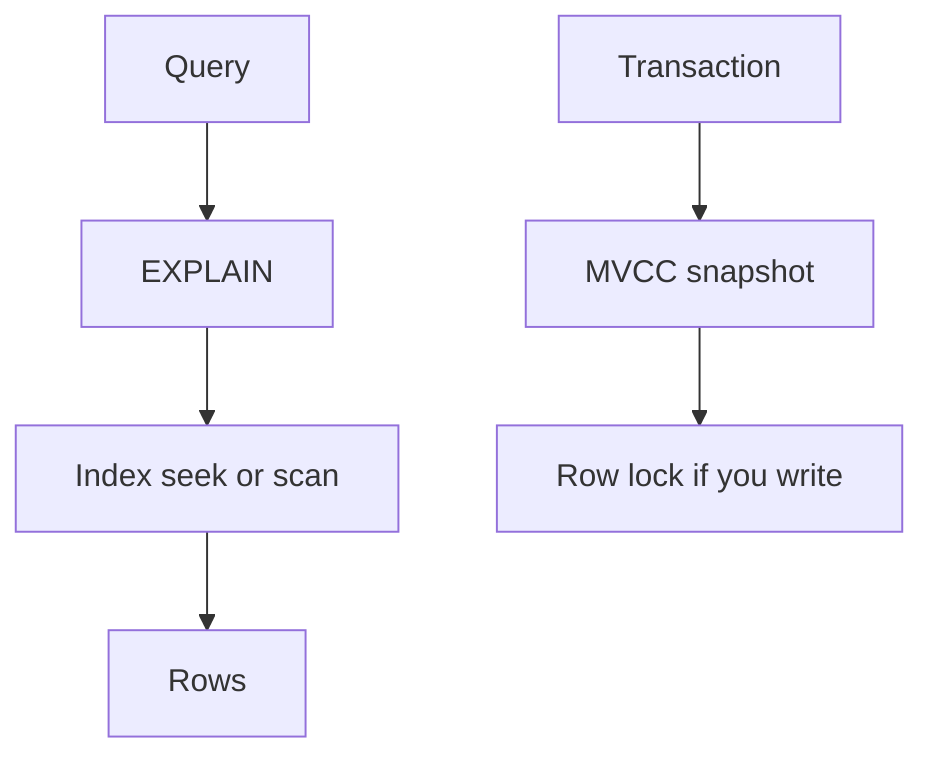

# Indexes, plans, and isolation

SQL · 45 min

JPA hides the database until a page gets slow. The interview asks what the database did, not which annotation you used.

## Flow



## What an index is

The heap stores rows. An index stores ordered keys plus pointers. A seek is cheap. A scan reads the table. A covering index holds every column the query needs, so the heap is not visited. Cardinality matters: an index on a boolean is rarely useful. Write the predicate first, then the index that matches its left prefix.

## Transactions you must be able to say

A transaction is atomic on commit or rollback. Lost update: two transactions read a balance and both write. Fix it with a version column (optimistic) or SELECT FOR UPDATE (pessimistic). Deadlock: A locks row 1 and wants row 2, B does the opposite. The database kills one. Retry the killed transaction. Phantom: a second read sees new rows. Isolation level or a constraint decides whether you care.

## How this meets JPA

Lazy associations plus a loop are the N+1. Fetch join or a batch size fixes it. An open session in the view hides the cost until the serializer runs. Optimistic lock is @Version. A failed version check is a retry, not a 500 you swallow. The SQL lesson is the reason the annotation exists.

## Play this

1. Filter columns want an index
2. Leftmost prefix of a composite index
3. Read committed is the usual start
4. A deadlock is a lock cycle

## Steps

- A B+ tree index supports equality and range. A column in a function often cannot use it.
- Composite index (bucket_id, created_at) serves WHERE bucket_id = ? ORDER BY created_at. It does not serve a predicate on created_at alone.
- EXPLAIN the slow repository method. Look for Seq Scan on a large table and for rows removed after the index.
- Isolation: read committed stops dirty reads. Repeatable read keeps a snapshot. Serializable refuses anomalies. Postgres uses MVCC, so readers do not block writers.

## Example

```text
EXPLAIN SELECT * FROM object_event
WHERE bucket_id = 'b1'
ORDER BY created_at DESC
LIMIT 20;
```

## The usual miss

Indexing every column and calling it tuned.

## They will ask

Why is this query a sequential scan?

## Before you close the laptop

Run EXPLAIN on the hottest query in the project and write one sentence about the plan.
