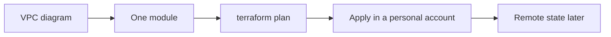

# One Terraform module after the diagram

Terraform · 30 min

Infrastructure as code is how the VPC you drew stays the VPC you deployed. It is useful. It is not a certification and not phase 1.

## Flow



## What you are declaring

The module for this project is small: a VPC public and private subnet story you can explain, a security group that allows the app port from the load balancer only, an S3 bucket for synthetic objects, and an RDS subnet group. Names match the diagram in the cloud lessons. If a resource is in the file and you cannot say why, delete it from the file.

## State and drift

Terraform state is a JSON map from your names to AWS ids. Two people applying without a lock will fight. A console click that Terraform does not know about is drift. Import or abandon it. None of this is required to pass a Java loop in January. It is required the week you deploy the project for real and want to talk about it.

## Play this

1. Resources match the diagram
2. Plan before apply
3. State is the source of what exists
4. Secrets stay out of the file

## Steps

- A resource block declares an VPC, a subnet, a security group, or an S3 bucket.
- terraform plan is the diff. Read it. Apply only what you meant.
- State maps the config to real ids. Lose the state and Terraform will try to create duplicates. For a real account, state lives in a remote bucket with a lock.
- Do this in phase 3, after IAM and VPC make sense. One module for the project network is enough.

## Example

```text
resource "aws_s3_bucket" "objects" {
  bucket = "prep-object-events-demo"
}
```

## The usual miss

Starting a 40-hour Terraform course before the first VPC is drawn.

## They will ask

What does terraform plan tell you that the AWS console does not?

## Before you close the laptop

Write the three resources the project needs. Do not apply them until the IAM lesson is done.
